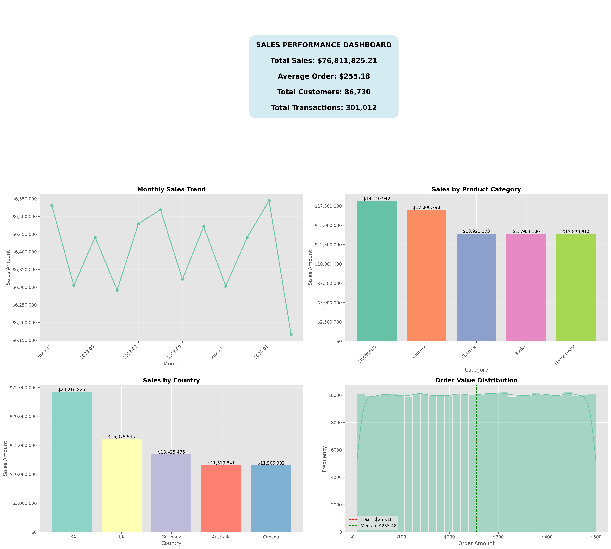

# Sales Performance Analysis Tool

This repository contains a comprehensive sales performance analysis toolkit designed to help businesses gain insights from their retail sales data. The toolkit includes data cleaning, analysis, visualization, and interactive dashboard capabilities.

## Table of Contents

- [Overview](#overview)
- [Features](#features)
- [Project Structure](#project-structure)
- [Installation](#installation)
- [Usage](#usage)
  - [Data Preparation](#data-preparation)
  - [Basic Analysis](#basic-analysis)
  - [Enhanced Analysis](#enhanced-analysis)
  - [Interactive Dashboard](#interactive-dashboard)
- [Example Outputs](#example-outputs)
- [Dependencies](#dependencies)
- [License](#license)

## Overview

The Sales Performance Analysis toolkit provides a suite of tools for analyzing retail sales data. It enables users to clean and prepare data, perform various analyses, generate visualizations, and create interactive dashboards. The toolkit is designed to be flexible, supporting data from both CSV/Excel files and SQL databases.

## Features

- **Data Cleaning**: Automated data cleaning including handling missing values, correcting data types, and removing outliers
- **Basic Sales Analysis**: Monthly trends, product category analysis, regional analysis, and marketing campaign impact
- **Enhanced Analysis**: Advanced metrics, shipping interval analysis, sales channel analysis, and time-based comparisons
- **Visualization**: Comprehensive charts and graphs for all analyses
- **Interactive Dashboard**: Streamlit-based interactive dashboard with filtering capabilities
- **SQL Integration**: Support for loading data directly from SQL databases
- **Report Generation**: Automated comprehensive report generation in Excel format

## Project Structure

```
SalesPerformanceAnalysis/
├── data/
│   ├── sales_data.csv
│   ├── new_retail_data.csv
│   └── new_retail_data_cleaned.csv
├── scripts/
│   ├── analyze_new_retail_data.py
│   ├── clean_retail_data.py
│   ├── create_sales_dashboard.py
│   ├── enhanced_sales_analysis.py
│   ├── generate_sample_data.py
│   ├── interactive_dashboard.py
│   ├── run_analysis.py
│   ├── sales_analysis.py
│   └── sql_analysis_example.py
├── reports/
│   ├── monthly_sales_trend.png
│   ├── top_product_categories.png
│   ├── regional_sales_distribution.png
│   ├── marketing_campaign_impact.png
│   └── sales_analysis_report.xlsx
└── sales_dashboard/
    ├── sales_dashboard.png
    ├── monthly_trend.png
    ├── top_products.png
    ├── feedback_impact.png
    └── customer_segment.png
```

## Installation

1. Clone the repository:
```bash
git clone https://github.com/yourusername/SalesPerformanceAnalysis.git
cd SalesPerformanceAnalysis
```

2. Install the required dependencies:
```bash
pip install -r requirements.txt
```

## Usage

### Data Preparation

1. **Generate Sample Data** (if you don't have your own data):
```bash
python scripts/generate_sample_data.py
```

2. **Clean Retail Data**:
```bash
python scripts/clean_retail_data.py
```

### Basic Analysis

Run the basic sales performance analysis:

```bash
python scripts/run_analysis.py
```

This will generate several visualizations and a comprehensive Excel report in the `reports/` directory.

### Enhanced Analysis

For more advanced analysis:

```bash
python scripts/analyze_new_retail_data.py
```

### Interactive Dashboard

Launch the interactive Streamlit dashboard:

```bash
streamlit run scripts/interactive_dashboard.py
```

### SQL Analysis

To analyze data from a SQL database, modify the connection string in `scripts/sql_analysis_example.py` and run:

```bash
python scripts/sql_analysis_example.py
```

## Example Outputs

### Monthly Sales Trend


### Product Category Analysis


### Regional Sales Distribution


### Marketing Campaign Impact


### Sales Dashboard


## Dependencies

- Python 3.7+
- pandas
- numpy
- matplotlib
- seaborn
- sqlalchemy
- streamlit
- plotly
- scipy
- openpyxl

## Core Components

### SalesPerformanceAnalysis Class

The main analysis class that provides methods for:
- Loading data from files or SQL databases
- Analyzing monthly sales trends
- Analyzing product categories
- Analyzing regional sales performance
- Measuring marketing campaign impact
- Generating comprehensive reports

```python
# Example usage
from sales_analysis import SalesPerformanceAnalysis

analyzer = SalesPerformanceAnalysis(data_source="data/sales_data.csv")
analyzer.load_data_from_file()
analyzer.monthly_sales_trend()
analyzer.product_category_analysis()
analyzer.regional_sales_analysis()
analyzer.marketing_campaign_impact()
analyzer.generate_comprehensive_report()
```

### EnhancedSalesAnalysis Class

Extends the basic analysis with more advanced features:
- Key business metrics calculation
- Shipping interval analysis
- Sales channel analysis
- Monthly/quarterly comparisons

```python
# Example usage
from enhanced_sales_analysis import EnhancedSalesAnalysis

enhanced_analyzer = EnhancedSalesAnalysis(data_source="data/sales_data.csv")
metrics = enhanced_analyzer.calculate_key_metrics()
enhanced_analyzer.shipping_interval_analysis()
enhanced_analyzer.sales_by_channel()
enhanced_analyzer.monthly_quarterly_analysis(period='monthly')
```

### Interactive Dashboard

A Streamlit-based interactive dashboard with:
- Dynamic filtering capabilities
- Multiple analysis tabs
- Downloadable filtered data
- Interactive visualizations

## License

This project is licensed under the MIT License - see the LICENSE file for details.